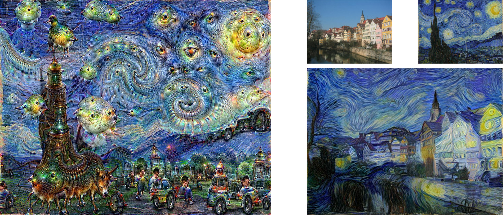

# Introduction and concept

In recent years researchers studies new algorithmically ways to compose soundscapes.
A generative soundscape usually borrows audio sources from existing audio databases.
Similarly to traditional techniques for computer composition, these algorithms always generate high level parameters for the performance of the musical piece.
High level parameters may include geo-location information, semantical meaning, or spectral characteristics of the sounds to use, and can affect later processing and mixing of the sounds.
However, with recent techniques from the field of machine learning it might be possible to generate streams of raw audio that are based only on the ability of computers and algorithms to learn by listening to audio.

In the current work I create a semi-generative soundscape that explores the computer's perception of digital privacy, using deep learning neural networks.
First, I recorded several hours of conversations and every-day sounds from my apartment, including intimate moments.
It is important to note that the audio sources deliberately contain a lot of private information.
Than, a deep neural network is trained with this recordings to extract understanding of patterns in the audio stream to later mimic them when generating raw audio.
Finally, these new audio sources will be used to compose a soundscape.
The final result investigate the relationships between art, algorithms, and digital privacy in the age of surveillance.

The following sections presents the literature background for the project and plans for realizing the concept.

# Literature review

The current work is based on interdisciplinary research.
As such, the following sections review studies and recent developments in the fields of generative soundscapes and raw audio generation.
Lastly, studies in digital privacy and works of surveillance art are presented in the context of the described concept.

## Generative soundscapes

Soundscapes tend to represent real world or artificial environments, as well as mental experiences such as dreams and memories, through sound [@Thorogood2013].
This medium dates back to the 1960s and traditionally involves the transparent editing and mixing of high quality field recording [@Truax2002; @Birchfield2005a].
In contrast to traditional composition and studio techniques, recent studies suggest frameworks for composing soundscapes algorithmically [@Birchfield2005;  @Finney2010; @Eigenfeldt2011; @Thorogood2013].

Choosing audio sources for a generative soundscape composition is an interesting topic addressed by the literature.
A common strategy is to search for audio samples by metadata in databases such as _freesound_[^freesound]. The search might query a specific or semantically similar tag [@Thorogood2013], geo-location [@Finney2010], or expected spectral characteristics [@Eigenfeldt2011].
Other examples include using user uploaded media samples from their daily lives [@Birchfield2005].

[^freesound]: [freesound.org](https://freesound.org/).

## Raw audio generation

A recent study by Van Den Oord et al. presented deep learning techniques for generating raw audio, sample by sample in an arbitrary high sampling rate [-@VanDenOord2016].
Their study shows promising results for musical applications[^wavenet-blog].
Existing algorithmic music studies, in comparison, always output score notation [@Papadopoulos2016] or other high level representation of to music or sound synthesis [@Cope1991; @Birchfield2003].
_TODO explain local conditioning._

In 2015, Mordvintsev, Olah, and Tyka published a blog post entitled "Inceptionism: Going deeper into Neural Networks"[^deepdream-blog].
This blog post shows how they modified deep learning algorithms for image classification to create new images.
In the public media, the project received the name _DeepDream_, after the idea that the images present the dreams of deep learning algorithms (see example in the left panel of figure \ref{deepdream-and-style-transfer}).
After _DeepDream_, Gatys et al. developed another technique for utilizing deep learning algorithms for artistic purposes.
This technique was later termed _style transfer_, and is used to apply the style of one image on the content of another, as presented in figure \ref{deepdream-and-style-transfer} right panel.

In the context of creative applications, the research of Van Den Oord et al. is perceived as a crucial first step toward _DeepDream_ and _style transfer_ in the audio domain[^audio-transfer-reddit].
Thus, it is not surprising that attempts are already being made to enable _style transfer_ in the audio domain based on the similar techniques[^audio-transfer-repo].

[^wavenet-blog]: [deepmind.com/blog/wavenet-generative-model-raw-audio](https://deepmind.com/blog/wavenet-generative-model-raw-audio/).
[^deepdream-blog]: [research.googleblog.com/2015/06/inceptionism-going-deeper-into-neural.html](https://research.googleblog.com/2015/06/inceptionism-going-deeper-into-neural.html).
[^audio-transfer-reddit]: [redd.it/51sr9t](https://redd.it/51sr9t).
[^audio-transfer-repo]: [github.com/Fr-d-rik/generative_audio](https://github.com/Fr-d-rik/generative_audio).

<!--
  In a recent blog post [^sony-csl-music] Sony's Computer Science Lab researchers published their AI composed song "Daddy's Car".

  [^sony-csl-music]: [www.flow-machines.com/ai-makes-pop-music](http://www.flow-machines.com/ai-makes-pop-music/).
-->

## Digital privacy

Privacy and freedom in the age of modern technology seems to be threaten both by national surveillance programs [@Milanovic2015] and by social media companies [@Gritzalis2014].
In response, artists are investigating the relationships between technology and privacy in a broad spectrum of mediums [@Tribe2006]:
Holly Herndon's "Home" is an example for a song that explores nowadays ubiquitous surveillance[^holly-herndon];
Artists incorporate surveillance techniques such as CCTVs[^cctv-art] directly into their art, or took photographs without consent[^photography-surveillance-art];
Surveillance is especially common as the subject in graffiti and street art [@Brighenti2010].

[^holly-herndon]: [carstenknoch.com/2015/05/surveillance-in-song](http://carstenknoch.com/2015/05/surveillance-in-song/).
[^cctv-art]: [stanza.co.uk/cctv_web](http://www.stanza.co.uk/cctv_web/index.html).
[^photography-surveillance-art]: [artnews.com/2014/09/09/privacy-and-surveillance-art](http://www.artnews.com/2014/09/09/privacy-and-surveillance-art/).

# Concept realization

The realization of the concept requires several hours of recordings, a deep neural network capable of learning and then generating raw audio with similar characteristics, and post processing phase for composing a soundscape from the resulted audio samples.

The audio sources for this project are several hours of conversations, fights, and intimate moments (including sex) of my partner and I, as well as every-day sounds such as cooking and dish washing.
All of the recordings were done with a Zoom H4n handheld audio recorder[^zoom] on a tripod in the same positioning in my apartment.
Each recording is manually chopped to contain only one content type.
For example, when a long recording starts with a conversation and continues with dish washing I manually cut it into two separated audio files.
The importance of this procedure will be explained when discussing the characteristics of the deep neural network algorithm.

Influenced by the promises of _WaveNet_, I hereby apply similar techniques to generate audio that mimics the sonic characteristics of the original sources but completely obscure the content.
To generate the audio I use the free and open source project _tensorflow-wavenet_[^tensorflow-wavenet], which is entitled as "a TensorFlow implementation of the WaveNet generative neural network architecture for audio generation".
Having audio files with homogeneous content will be used to train the deep neural network, when the content will be considered as the global context.
In the study of Van Den Oord et al. the context was the speaker; in the current work the context is the content of the audio source.
After training the model I generate audio streams that are both unconditional and globally conditioned on each content type.

Finally, the resulted audio samples are composed manually, using the REAPER DAW[^reaper], to create the final soundscape.
The composition considers the different types of contents to build up an interesting story from the samples.
The exact composition and post processing techniques will depend on the characteristics of the generated audio samples, which, in this step of the project, are unclear.

[^zoom]:[zoom-na.com/products/field-video-recording/field-recording/zoom-h4n-handy-recorder](https://www.zoom-na.com/products/field-video-recording/field-recording/zoom-h4n-handy-recorder)
[^tensorflow-wavenet]: [github.com/ibab/tensorflow-wavenet](https://github.com/ibab/tensorflow-wavenet).
[^reaper]: [reaper.fm](http://reaper.fm/).

## Current state

The training of the deep neural network model and the generation of the audio was not started yet.
I still need to figure out how much computational power this project will require, and what will be considered as feasible.

However:

- I already recorded around 10 hours of diverse materials.
- I started to learn and experiment with _tensorflow-wavenet_.
- There is a good chance that my computer doesn't have enough compute power, so I am checking cloud compute offerings by Amazon Web Services and Microsoft Azure.

## Optimistic scenario

In my optimistic scenario I will be able to train the model with global conditioning based on context.
Using this model, I will generate a few minutes stream from each content for later composition and post processing.
This scenario will not require a lot of post processing.
In general, according to my optimistic scenario the compositional part of the soundscape will require the selection of interesting segments from the generated audio and concatenate them by content in a meaningful way.

## Realistic scenario

In a more realistic scenario I would not be able to generate long streams of audio, but only short samples (in the scale of a few seconds).
Using such samples will require a more involved compositional and post processing phase.

# References
