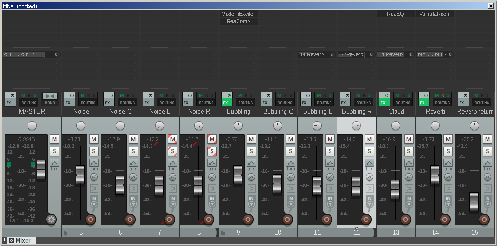
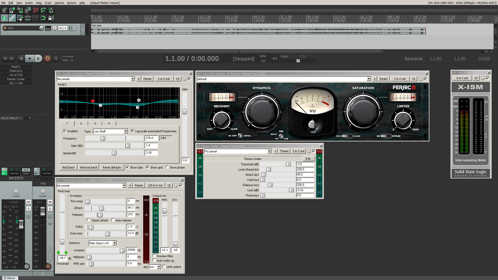

# Introduction and concept

In recent years researchers studies new algorithmically ways to compose soundscapes.
Similarly to traditional techniques for computer composition, these algorithms always generate high level parameters for the performance of the musical piece, and usually use audio sources from existing audio databases.
High level parameters may include geo-location information, semantical meaning, or spectral characteristics of the sounds to use, and can affect later processing and mixing of the sounds.
However, with recent techniques from the field of machine learning it might be possible to generate streams of raw audio that are based only on the ability of computers and algorithms to learn by listening to audio.

In the current work I create a semi-generative soundscape that explores the computer's perception of digital privacy, using deep learning neural networks.
First, I record several hours of conversations and every-day sounds from my apartment, including intimate moments.
It is important to note that the audio sources deliberately contain a lot of private information.
Than, a deep neural network is trained with these recordings, extract patterns in the audio stream and build up artificial understanding of audio characteristics to later mimic them when generating raw audio.
Finally, these new audio sources are used to compose a soundscape.
The final result investigate the relationships between art, algorithms, and digital privacy in the age of surveillance.

The following sections present the literature background for the project and plans for realizing the concept.

# Literature review

The current work is based on interdisciplinary research.
As such, the following sections review studies and recent developments in the fields of generative soundscapes and raw audio generation.
Lastly, studies in digital privacy and works of surveillance art are presented in the context of the described concept.

## Generative soundscapes

Soundscapes tend to represent real world or artificial environments, as well as mental experiences such as dreams and memories, through sound [@Thorogood2013].
This medium dates back to the 1960s and traditionally involves the transparent editing and mixing of high quality field recording [@Truax2002; @Birchfield2005a].
In contrast to traditional soundscape composition techniques, recent studies suggest frameworks for composing soundscapes algorithmically [@Birchfield2005;  @Finney2010; @Eigenfeldt2011; @Thorogood2013].

According to Eigenfeldt and Pasquier the four basic principles of the medium should be preserved in generative soundscape composition [-@Eigenfeldt2011]:

- The audio materials should be recognizable.
- The composition should invoke the listener's psychological context of the environment.
- The composer understanding of the environment should be mirrored by the composition.
- The resulted soundscape should enhance our understanding of the world.

Choosing audio sources for a generative soundscape composition is an interesting topic addressed by the literature.
A common strategy is to search for audio samples by metadata in databases such as _freesound_[^freesound]. The search might query a specific or semantically similar tag [@Thorogood2013], geo-location [@Finney2010], or expected spectral characteristics [@Eigenfeldt2011].
Other examples include using user uploaded media samples from their daily lives [@Birchfield2005].

[^freesound]: [freesound.org](https://freesound.org/).

## Raw audio generation

A recent study by Van Den Oord et al. presented deep learning techniques for generating raw audio, sample by sample in an arbitrary high sampling rate [-@VanDenOord2016].
_WaveNet_, the algorithm they developed, shows promising results for musical applications[^wavenet-blog].
Compared to _WaveNet_, existing algorithms for generative music composition always output score notation [@Papadopoulos2016] or other high level representation of music or sound synthesis [@Cope1991; @Birchfield2003].

In 2015, Mordvintsev, Olah, and Tyka published a blog post entitled "Inceptionism: Going deeper into Neural Networks"[^deepdream-blog].
This blog post shows how they modified deep learning algorithms for image classification to create new images.
In the public media, the project received the name _DeepDream_, after the idea that the images present the dreams of deep learning algorithms (see example in the left panel of figure \ref{deepdream-and-style-transfer}).
After _DeepDream_, Gatys et al. developed another technique for utilizing deep learning algorithms for artistic purposes [-@Gatys2015].
This technique was later termed _style transfer_, and is used to apply the style of one image on the content of another, as presented in the right panel of figure \ref{deepdream-and-style-transfer}.

In the context of creative applications, the research of Van Den Oord et al. is perceived as a crucial first step toward _DeepDream_ and _style transfer_ in the audio domain[^audio-transfer-reddit].
Thus, it is not surprising that attempts are already being made to enable _style transfer_ in the audio domain based on similar techniques[^audio-transfer-repo].

[^wavenet-blog]: [deepmind.com/blog/wavenet-generative-model-raw-audio](https://deepmind.com/blog/wavenet-generative-model-raw-audio/).
[^deepdream-blog]: [research.googleblog.com/2015/06/inceptionism-going-deeper-into-neural.html](https://research.googleblog.com/2015/06/inceptionism-going-deeper-into-neural.html).
[^audio-transfer-reddit]: [redd.it/51sr9t](https://redd.it/51sr9t).
[^audio-transfer-repo]: [github.com/Fr-d-rik/generative_audio](https://github.com/Fr-d-rik/generative_audio).

### Global conditioning

One important aspect in the work of Van Den Oord et al. is the idea of global conditioning.
They trained their model with audio excerpts of English sentences made by several speakers.
The model thereby learned the general characteristics of the English language, as well as the special characteristics of each speaker.
Later, the raw audio generation process could be controlled to mimic each speaker by conditioning the model to use its understanding of the specific speaker characteristics.
The concept of local conditioning and its applications, as presented in this study, will not be addressed in the current work.

### Training steps

Training a deep neural network like _WaveNet_ is done iteratively.
As the number of iterations done during training phase, the model ability of to understand the characteristics of the input field increase.
However, there is always a trade-off, as each step might take a lot of time and resources to compute.
Therefore, deep neural networks are usually trained on dedicated hardware that can accelerate the steps.

### Receptive field

In the context of _WaveNet_, the receptive field is measured in milliseconds and is the period of time before each sample that affect the generation of it.
For example, most of the samples I used in this soundscape have a receptive field of between 300ms and 500ms, meaning that each sample was calculated based on the previous 300 to 500 milliseconds of audio.
Increasing the receptive field usually result in a more natural sound, but doing so encounter the same computational limitation from before, as it extends the time and resources need to train the model properly.

## Digital privacy

Privacy and freedom in the age of modern technology seems to be threaten both by national surveillance programs [@Milanovic2015] and by social media companies [@Gritzalis2014].
In response, artists are investigating the relationships between technology and privacy in a broad spectrum of mediums [@Tribe2006]:
Holly Herndon's "Home" is an example for a song that explores nowadays ubiquitous surveillance[^holly-herndon];
Artists incorporate surveillance techniques such as CCTVs[^cctv-art] directly into their art, or took photographs without consent[^photography-surveillance-art];
Surveillance is especially common as the subject in graffiti and street art [@Brighenti2010].

[^holly-herndon]: [carstenknoch.com/2015/05/surveillance-in-song](http://carstenknoch.com/2015/05/surveillance-in-song/).
[^cctv-art]: [stanza.co.uk/cctv_web](http://www.stanza.co.uk/cctv_web/index.html).
[^photography-surveillance-art]: [artnews.com/2014/09/09/privacy-and-surveillance-art](http://www.artnews.com/2014/09/09/privacy-and-surveillance-art/).

# Concept realization

The realization of the concept requires several hours of recordings, a deep neural network capable of learning and then generating raw audio with similar characteristics, and post processing phase for composing a soundscape from the resulted audio samples.

Originally, I planned to use recordings of several hours of conversations, fights, and intimate moments (including sex) of my partner and I, as well as every-day sounds such as cooking and dish washing.
Influenced by the promises of _WaveNet_, I tried to train a deep neural network with this private audio files.
This way, after learning the sonic characteristics of the original sources it might be able to generate similar but content-less audio.
I used the free and open source project _tensorflow-wavenet_[^tensorflow-wavenet], which is entitled as "a TensorFlow implementation of the WaveNet generative neural network architecture for audio generation".
Unfortunately, I failed to use this technology to generate raw audio that demonstrate similar sonic characteristics to the sources.
An elaborated explanation this attempt didn't succeed is presented in the next section.

Finally, instead of generating audio for the soundscape I used samples of other users of the same software package that are available online.
I used the REAPER DAW[^reaper] to edit, mix, and master the final soundscape.
In general, the composition followed the four basic soundscape composition principles of Eigenfeldt and Pasquier using the algorithmically generated materials crowd sourced from the web.

[^zoom]:[zoom-na.com/products/field-video-recording/field-recording/zoom-h4n-handy-recorder](https://www.zoom-na.com/products/field-video-recording/field-recording/zoom-h4n-handy-recorder).
[^tensorflow-wavenet]: [github.com/ibab/tensorflow-wavenet](https://github.com/ibab/tensorflow-wavenet).
[^reaper]: [reaper.fm](http://reaper.fm/).

## Why the original plan failed

I started by recording approximately 10 hours of diverse materials, as planned, using the Zoom H4n handheld audio recorder[^zoom] on a tripod in my apartment.
Each recording was manually sliced to create audio files that contain homogeneous content.
For example, when a long recording starts with a conversation and continues with dish washing I manually slice it into two separated audio files.
I intended to rely on the homogeneity of the audio files to train the deep neural network, when the content is considered as the global conditioning context.
In the study of Van Den Oord et al. the global context for conditioning was the speaker; in the current work the context is the content of the audio source.

After training the model with this content the generated audio contained nothing but noise and crackles.
In retrospective, there are several reason for this first failure:

- Compared to the VCTK corpus, which is used by Van Den Oord et al. and by the _tensorflow-wavenet_ users, my audio files were way more noisy.
- Similarly, my audio files were more sonically diverse, preventing the model from generalizing properly.
- I probably used too long receptive field.
I tried to reduce the sample rate from 16Khz to 8Khz to train the model faster but kept the dilated layers with the same length.
The training might run faster if I reduce the dilated layer length, without scarifying the model ability to generalize.
- Lastly, all of the successful results from _tensorflow-wavenet_ users used more than 15,000 training steps, when best results achieved after 50,000 steps or more.
On my computer it is just not feasible, as it takes approximately 10 seconds for training step (~6 days to reach 50K steps).

As a second attempt I tried to train the model on the VCTK corpus, as several users did and succeeded.
For me, it was a required step to make sure that I know how to use the software properly, what are its capabilities, and what can be considered computational feasible using my setup.
This attempt also failed, but I managed to learn most of the above points from its failure.
In addition, I found out that training a model on the whole dataset is even more computationally intensive and most users train the model on single speaker or even single audio file (a sentence recorded by a speaker).

Lastly, I tried to use Amazons' services for training the model on a computer in the cloud that is much more capable than mine and has a GPU for deep learning.
However, the registration should be manually accepted by the support team, and by the time I got a response from them I already choose an alternative realization for the concept.

To summarize, all of my attempts to use _tensorflow-wavenet_ failed.
I learned from the failures, but not fast enough to find solutions in time for this assignment.

## An alternative

Instead of generating all of the audio samples for the soundscape I choose to compose a soundscape from samples from three main sources:

1. **Mine**: samples I generated using _tensorflow-wavenet_ and are generally used as noise sources.
However, in some of the samples the resulting noisy signal have some temporal speech like characteristics, so I used them in the composition.
These samples can be found online[^my-samples].
1. **Users**: samples downloaded from _tensorflow-wavenet_ users.
In this case, the model was properly trained and the output is perceptually similar to speech sounds.
Samples in this category are the most varied due to different approaches and constrains the users of the library had.
All of these samples were downloaded from discussions about the project on github[^tensorflow-wavenet-samples].
1. **Wavenet**: samples downloaded from the section titled "Knowing what to say" in google's blog post about wavenet, which accompanied the research paper with audible examples.
This category presents the most speech like samples from the three.

By using samples that were created with deep neural network, and mimic speech sounds, the general concept is still preserved.
The privacy concern that presented by the original concept is somewhat weakened, because the original audio sources (mainly the VCTK corpus) does not contain private information, but is publicly available.
However, the samples can be seen as the artificial understanding of speech by a computer.
Therefore, questions of privacy and our relations with technology still present in the final result.

[^my-samples]: [github.com/Nagasaki45/digital-privacy-soundscape/tree/master/samples/mine](https://github.com/Nagasaki45/digital-privacy-soundscape/tree/master/samples/mine).
[^tensorflow-wavenet-samples]: [github.com/ibab/tensorflow-wavenet/issues/47](https://github.com/ibab/tensorflow-wavenet/issues/47).
[^vctk-corpus]: [homepages.inf.ed.ac.uk/jyamagis/page3/page58/page58.html](http://homepages.inf.ed.ac.uk/jyamagis/page3/page58/page58.html).

# Production decisions

## Composition

The soundscape follows a gradual transition from noise to artificial speech-like sounds and back to noise.
It is composed of three main parts.
The first presents the transition until the computer can speak;
the second explores different characteristics of the artificially generated speech;
the third regress back to the starting point and ends the piece with noise sounds.

The first part of the soundscape starts with two bursts of noise which are a recurring motive throughout the piece.
Than, it takes the listener through the different stages of how the computer perceive speech:
At the beginning the noise sounds have no structure that could resemble speech.
Than, it starts to form temporal structure and transform to abrupt and incoherent sounds of spoken syllables.
The part ends by building up a cloud of babbling sounds.
This cloud gradually gets darker and goes to the back to give space of the second part of the piece.

The second part of the soundscape starts while the cloud of babbling sounds is still playing in the background.
A narrator starts to talk with the first voice in the composition that mimic human behaviour well.
The fact that the content of the narration is meaningless makes the experience mysterious and somewhat annoying.
Than, the narrator is interrupted by another voice, and shortly after a group of more human sounding speakers join the intense conversation.
During the second part of the piece there is exploration of different aspects of the artificially speech.
It involve dense conversations between different voices, a cloud of babbling (borrowed from the first part), and noises that interfere during pauses.
This part come to an end in a distinct cut in the dense mesh of voices, short burst of noise, and significant change in harmonic content that mark the start of the third part.

The third and last part of the piece starts with a babbling cloud, now based on the voices from the conversations of part two.
This cloud starts far from the listener and gets closer over time.
In addition, the babbling gradually replaced by the noises from the beginning.
These two characteristics mirror the cloud that ends the first part.
The piece ends with more noises and incoherent sounds of spoken syllables that were presented in the first part.
As opposed to the first part, they are now accompanied by a sounds from the second part in the far background.
The final phrase in the soundscape is the burst of noises that open the piece.

This cyclic structure invite the listener to hear how algorithms listen to and mimic human speech.
The uniqueness of the audio sources used in the soundscape are mysterious, fascinating, and annoying at the same time, especially when considering the possibility that technology is always listening to our everyday life.
Gradually returning to the beginning when only noises are presented allows the listener to reflect on the auditory/technological journey.

## Layout and editing

In this section I will describe the technical part of the composition, which mainly involved precise editing and manipulating the samples.
This processes are usually described as part of the mixing phase of a track, but I prefer to describe them separately due to the role of the techniques in the soundscape:
whereas mixing usually starts after all of the material is organized in time, the techniques below are crucial part in the organization of the material.

The soundscape was composed, edited, mixed and mastered using the REAPER DAW.
Figure \ref{daw-arrangement} shows the arrangement view.
The colors of the samples indicate to which category they belong:
Samples in red are from the category **mine**;
Samples in green are from the category **users**;
Samples in blue are from the category **wavenet**;
Samples in yellow are the bounces of the reverb channel.
Using this color coding of samples it is clearly visible that the soundscape gradually move from using samples from the **mine** category, through the **users** category, and to the **wavenet** category.
Towards the end of the piece the process is reversed.
The special characteristic of each samples category was used in this way to support the composition.

It is important to note that although the samples of the **users** category generally demonstrate well sounded human speech sounds they still contain a lot of noise (clicks).
Moreover, all of the samples in the composition are sampled in a sample rate of 16Khz.
I found this issues somewhat problematic during the mastering process, but overall, the "lo-fi" characteristic can support the general concept of algorithmic perception of human behavior.

The whole soundscape is organized as three audio groups: noise, babbling, and cloud.
The noise and the babbling groups contain three tracks each, one for left panned content, one for right panned content, and one for the content in the middle.
I found that this organization of content to be both productive and creative.

The cloud track uses the REAPER feature of tracks with "Free item positioning".
That way I can place several different items that will play in parallel on the same track.
The cloud track is used for both noises and babbling sounds.
The "Free item positioning" feature allow me to transition gradually between clouds of different audio sources.
Having the different sources on the same track unify them as the pass through the same effects.
For example, in 0:50-1:00 there is a transition between different audio materials in a cloud, from noises to babbling, while the cloud as a whole goes back in the mix using effects automation.
I wrote a script to randomise panning of items[^random-panning-script] and used it on most of the clouds in the composition to made them rich and wide sounding.
In addition, I tend to apply time stretching and pitch shifting manually to some of the clouds to emphasize specific peaks in the composition (an example can be heard 2:01-2:10).

Another "audio source" I used in the composition is the bounced output of the reverb channel.
Starting in the second part of the composition, I wanted most of the speech like sounds to be relatively clear, without reverb.
However, I found that after a cloud ends the continuation without a reverb make the sound too thin.
To solve this I recorded the sound of the reverb channel (only the wet signal), and used it as another audio source.
For example, during most of the second part of the composition there is a wet reverb signal playing parts of the first part of the composition.
This technique added a lot of depth to the mix, but without blurring the speech sounds in the front of the mix (such as the narrator that opens the second part).

## Mixing

The mixing stage of the soundscape did not involve a lot of manipulation, as most of the work was already done in the previous step as described before.
However, I found that the babbling group lacked high frequency content and was dynamically unstable.
To solve this I used an exciter to open up the higher frequencies and a compressor to reduce the dynamic range of the group.

The reverb used in the composition is the Valhalla Room[^valhalla-room], set to long dark reverberation.
I decided to send the left and right tracks of the babbling group to the reverb and added automation to send the cloud to the reverb during the second part of the composition.

The final mix was rendered in 24Bit and 44.1Khz.
The output wav file had a headroom of 11db.

[^valhalla-room]: [valhalladsp.com/shop/reverb/valhalla-room](https://valhalladsp.com/shop/reverb/valhalla-room)

## Mastering

During the mastering process I found that the soundscape contains almost no high frequency content.
This is the result of using audio sources with sample rate of 16Khz, that have spectral content up to 8Khz according to Nyquist–Shannon sampling theorem [@shannon1949communication].
I tried to add some higher frequency content by using exciters, overdrive on parallel track, saturation emulators and more but non of the solution really opened up the higher frequencies without sounding to harsh.
Thereby, I decided that I won't fix this issue and will leave it as is.

For the mastering I used 4 traditional mastering audio effects on the main bus:

- **EQ** to boost the low and high ends of the spectrum and attenuate some blur in the low mids and harsh sound in the high mids.
- **Compressor** with ratio of 1.5 and slow attack and release to reduce the dynamic range by up to 6db. This compressor is very clean and I found it perfect for the mastering task.
- **Tape simulator** to add saturation and warm up the overall mix a bit. Note that the dynamics section of the effect was not used.
- **Mastering limiter** with threshold set to -3db to make sure that the final result doesn't clip, and to boost the overall signal in few more decibells. The maximum output is set to a value lower than 0 to make sure no inter-sample peaks will clip.

The tape simulation on the main bus is very responsive to changes in input gain.
I wanted it to work on relatively hot signal, so I started by boosting the mix track by 10db, causing it to play close to the 0db limit of the DAW.
If I wasn't using this tape simulation I would probably keep the mix track on 0db and boost the entire mastering by the limiter at the end of the mastering chain.

Finally, I used an inter-sample peak meters to make sure that there is no clipping.

# Discussion

# Conclusion

# Appendix A: List of sounds

Table \ref{samples-table} presents all of the audio samples used in the soundscape.
The columns in the table are:

- **Sample** - the name and exact location of the sample online[^nagasaki45-samples].
- **Steps** - the number of steps used to train the model that was used to generate this sample.
- **RF** - the receptive field that was used when training the model.

Table: \label{samples-table}Samples used in the soundscape. Bootstrapping refers to samples that start with audio sources from the dataset and continues with generated audio.

-----------------------------------------------------------------------------------------------------------------------------------------------------------------------------------------------------------------
Sample                                              Steps     RF         Details
--------------------------------------------------- --------- ---------- ----------------------------------------------------------------------------------------------------------------------------------------
`mine/generated<X>.wav`                             <1K       600ms      Trained on recordings from my apartment.

`mine/large.wav`                                    4,695     600ms      Trained on recordings from my apartment.

`mine/vctk<X>.wav`                                  `<X>`     600ms      Trained on the whole VCTK corpus.

`wavenet/<X>.wav`                                   N/A       N/A        Samples downloaded from google's blog post about wavenet.

`users/01.mp3`                                      28K       60ms       [Trained on a single sample from the VCTK corpus](https://soundcloud.com/user-952268654/wavenet-28k-steps-of-100k-samples).

`users/02.mp3`                                      28K       250ms      [Trained on speaker 280 from the VCTK corpus](https://soundcloud.com/user-731806733/generated-larger-1).

`users/03.mp3`                                      15K       200ms      [Trained on speaker 280 from the VCTK corpus](https://soundcloud.com/travis-morton-654696702/mortont-generated-audio).

`users/04.mp3`                                      12K       350ms      [Trained on speaker 280 from the VCTK corpus with bootstrapping](https://soundcloud.com/travis-morton-654696702/mortont-generated-audio).

`users/05.mp3`                                      40K       500ms      [Trained on speaker 280 from the VCTK corpus](https://soundcloud.com/user-731806733/tensorflow-wavenet-500-msec).

`users/06.mp3`                                      88K       500ms      [Trained on speaker 280 from the VCTK corpus](https://soundcloud.com/user-731806733/tensorflow-wavenet-500-msec-88k-train-steps).

`users/07<X>.mp3`                                   N/A       N/A        [Trained on speaker 266 from the VCTK corpus](https://soundcloud.com/underwhelming-force/sets/wavenet-experimentation-iii/s-46gyC).

`users/08.mp3`                                      53K       130ms      [Trained on the whole VCTK corpus](https://soundcloud.com/adroit_91/tensorflow-wavenet-generated-samples-27th-sep-code).

`users/09.wav`                                      >80K      N/A        [Trained on the whole VCTK corpus](https://github.com/ibab/tensorflow-wavenet/files/499777/generated_59800_27Sep.wav.zip).

`users/10.mp3`                                      67K       N/A        [Trained on a Korean speech corpus](https://soundcloud.com/nako-sung/67200a).

`users/11.mp3`                                      N/A       250ms      [Trained on a Korean speech corpus](https://soundcloud.com/nako-sung/wavenet-korean-corpus-female-receptive-250msloss-25).

`users/12.mp3`                                      50K       300ms      [Trained on a Korean speech corpus](https://soundcloud.com/nako-sung/test).

`users/13.mp3`                                      50K       300ms      [Trained on a Korean speech corpus](https://soundcloud.com/nako-sung/test-3-wav).
-----------------------------------------------------------------------------------------------------------------------------------------------------------------------------------------------------------------

[^nagasaki45-samples]: [github.com/Nagasaki45/digital-privacy-soundscape/tree/master/samples](https://github.com/Nagasaki45/digital-privacy-soundscape/tree/master/samples).

# Appendix B: Screenshots

![\label{daw-arrangement}The arrangement view in REAPER DAW. Samples in red are from the category **mine**. Samples in green are from the category **users**. Samples in blue are from the category **wavenet**. Samples in yellow are the bounces of the reverb channel. The Cloud channel uses the "Free items positioning" feature of REAPER and is presented in the middle of the figure. Automations lines for stereo width of the Noise group, reverb send and EQ dry/wet controller for the Cloud channel are also presented.](media/daw_arrangement.png)

\newpage

# References
